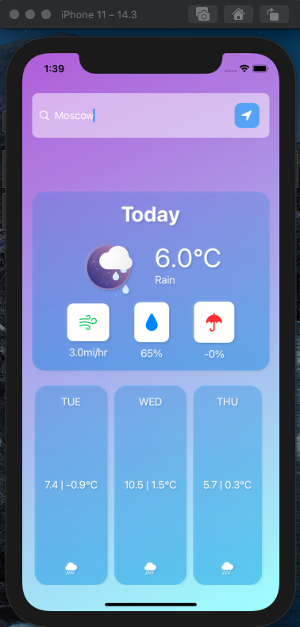
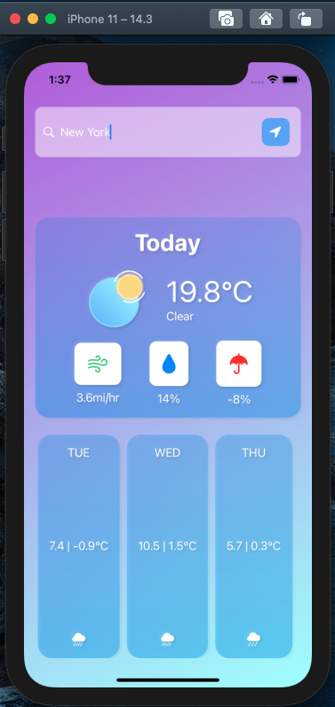

# SwiftUI-Weather

# Weather App
Weather is a simple app that displays weather in SwiftUI.
I was using MVVM Design Pattern to create this simple app.
Also I've used Lottie animation for weather icons, you have to install Lottie using SPM or Cocoa Pods.
So enjoy to test it and good luck!)
